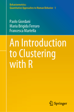

```{r setup, include=FALSE}
knitr::opts_chunk$set(echo = TRUE)
```

En este R notebook encontrarás un apunte de Clustering en R, del libro `An Introduction to Clustering with R` de los autores `Paolo Giordani`,
`Maria Brigida Ferraro` y `Francesca Martella` de la editorial `Springer`. Vease <https://www.springer.com/gp/book/9789811305528>.




## Contenidos

- Introduction to Clustering

- Hierarchical Clustering

- Non-Hierarchical Clustering

- Big Data and Clustering

- Fuzzy Clustering

- Model-Based Clustering

- Issues in Gaussian Model-Based Clustering
